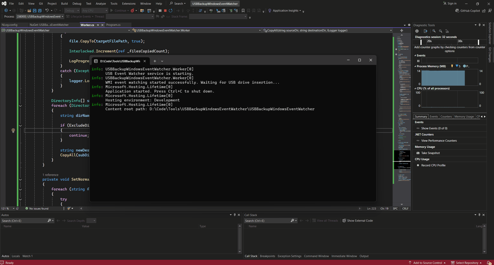

# USBDataBackup_WIndowsService



---

# 💾 USB Auto-Backup Service (USB Event Watcher)

A dedicated **.NET Worker Service** built for Windows that automatically performs a one-way file backup whenever a designated USB drive is inserted. This tool runs silently in the background, leveraging **WMI (Windows Management Instrumentation)** to reliably detect drive connection events, making it ideal for continuous, hands-free data backup.

## ✨ Features

- **Native Windows Service:** Runs independently of any logged-in user for continuous monitoring.
- **Event-Driven:** Uses WMI to instantly detect USB drive insertions (no constant polling required).
- **Targeted Backup:** Only executes the backup when the configured drive letter (`TargetDrive`) is detected.
- **Simple Configuration:** Easily customize the source, destination, and target drive via the application's settings file.

---

## ⚙️ Configuration

Before deploying the service, you must configure the following three constants in the application's configuration file (usually `appsettings.development.json` or equivalent environment variables).

| Setting Name  | Description                                                                                                                  | Example Value           |
| :------------ | :--------------------------------------------------------------------------------------------------------------------------- | :---------------------- |
| `From`        | The **full path** to the local folder whose contents you wish to copy.                                                       | `"C:\\Users\\YourName"` |
| `To`          | The name of the folder **on the USB drive** where the files will be copied. This folder will be created if it doesn't exist. | `"G:\\Backup"`          |
| `TargetDrive` | The **specific drive letter** (e.g., `G:`) the service should listen for before initiating the backup.                       | `"G:"`                  |

---

## 🛠️ Installation Guide (Windows Service)

To ensure this tool runs reliably in the background, you must publish the application and install it as a native Windows Service.

### Step 1: Publish the Application

1.  **Open** the project in Visual Studio.
2.  **Right-click** on the project in Solution Explorer and select **Publish...**.
3.  Choose a target folder (e.g., `C:\Services\USBBackup`).
4.  In the Publish Profile settings:
    - **Target Framework** should be set to the value used to fix the CA1416 warning (e.g., `net8.0-windows`).
    - **Deployment Mode** should typically be set to `Self-contained` or `Framework-dependent`.
    - Click **Publish**.

### Step 2: Install the Service via Command Prompt

Once the application is published, use the **Service Control utility (`sc.exe`)** in an **elevated command prompt** to register the executable.

1.  **Open Command Prompt as Administrator.**
2.  Navigate to the directory where you published the `.exe` file:
    ```bash
    cd C:\Services\USBBackup
    ```
3.  Execute the following command, replacing the path with the full path to your published executable:
    ```bash
    sc.exe create "USBBackupService" binPath="C:\Services\USBBackup\USBBackupWindowsEventWatcher.exe" start=auto DisplayName="USB Drive Auto Backup Service"
    ```

### Step 3: Start the Service

1.  Wait for the command prompt to return `[SC] CreateService SUCCESS`.
2.  You can now start the service using the Services Manager (`services.msc`) or via the command line:
    ```bash
    sc.exe start "USBBackupService"
    ```

### Step 4: Verification

1.  Open the **Services Manager** (`services.msc`).
2.  Find **"USB Drive Auto Backup Service"** in the list.
3.  Confirm that the **Status** is **Running** and the **Startup Type** is **Automatic**.
4.  Test the service by inserting your configured `TargetDrive`. Check the destination path on the USB drive to confirm the files were copied.

### 🛑 Uninstalling the Service

To remove the service, first stop it, then delete it using the following commands (run as Administrator):

```bash
sc.exe stop "USBBackupService"
sc.exe delete "USBBackupService"
```
